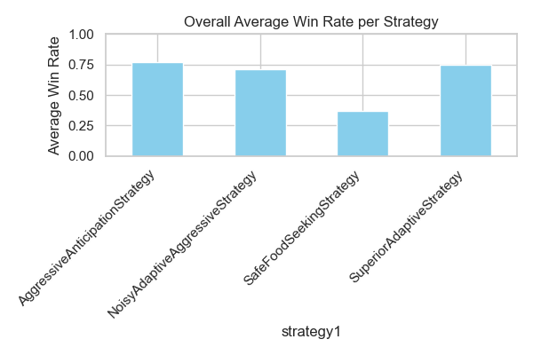
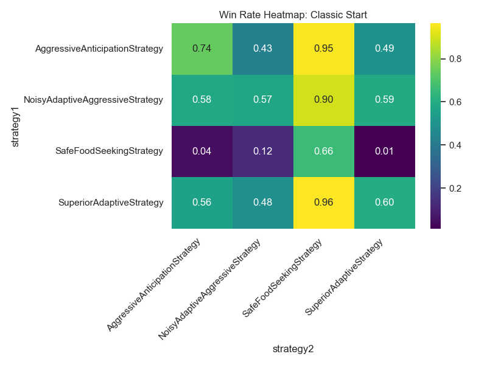
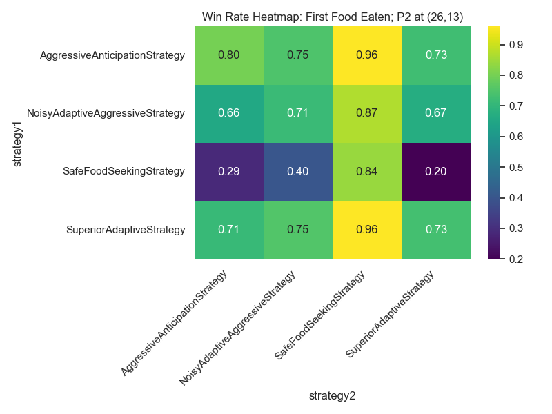
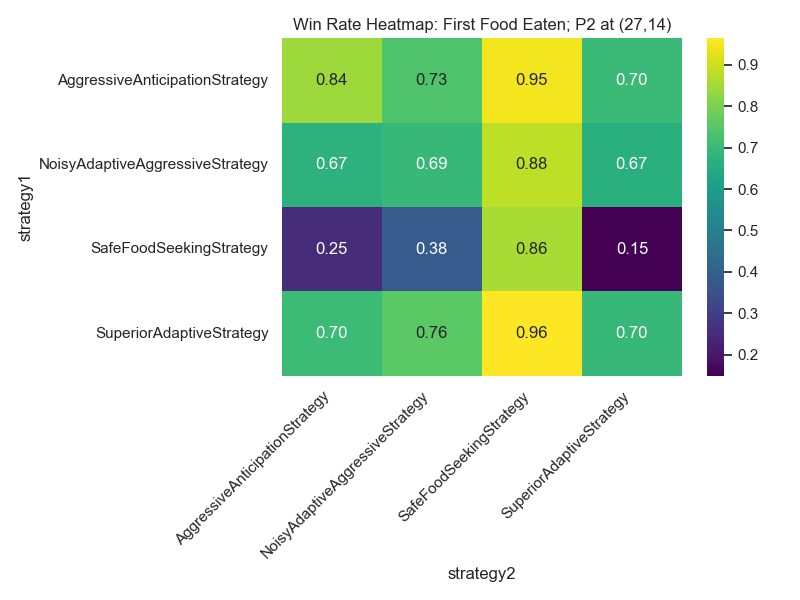
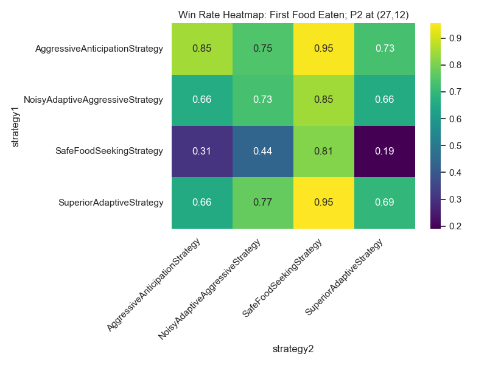
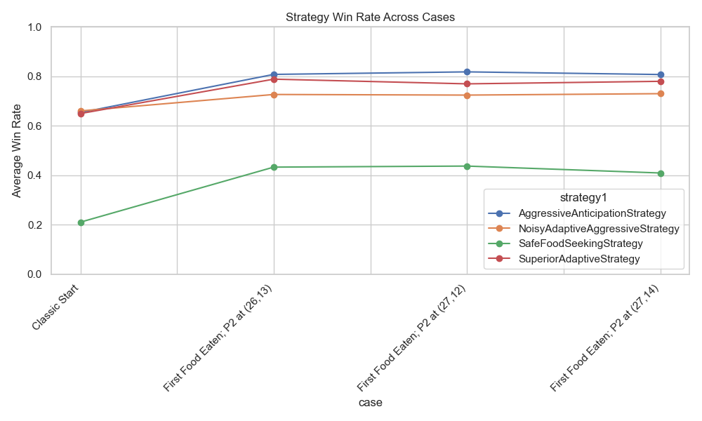

# Simulation Results Analysis

## Overall Average Win Rate per Strategy

| strategy1                       |   avg_win_rate |
|:--------------------------------|---------------:|
| AggressiveAnticipationStrategy  |       0.771813 |
| NoisyAdaptiveAggressiveStrategy |       0.710313 |
| SafeFoodSeekingStrategy         |       0.372188 |
| SuperiorAdaptiveStrategy        |       0.747    |

## Case: Classic Start

### Win Rate Matrix (Strategy1 vs Strategy2)

| strategy1                       |   AggressiveAnticipationStrategy |   NoisyAdaptiveAggressiveStrategy |   SafeFoodSeekingStrategy |   SuperiorAdaptiveStrategy |
|:--------------------------------|---------------------------------:|----------------------------------:|--------------------------:|---------------------------:|
| AggressiveAnticipationStrategy  |                            0.739 |                             0.427 |                     0.953 |                      0.495 |
| NoisyAdaptiveAggressiveStrategy |                            0.582 |                             0.574 |                     0.895 |                      0.59  |
| SafeFoodSeekingStrategy         |                            0.042 |                             0.124 |                     0.662 |                      0.012 |
| SuperiorAdaptiveStrategy        |                            0.556 |                             0.482 |                     0.964 |                      0.596 |

## Case: First Food Eaten; P2 at (26,13)

### Win Rate Matrix (Strategy1 vs Strategy2)

| strategy1                       |   AggressiveAnticipationStrategy |   NoisyAdaptiveAggressiveStrategy |   SafeFoodSeekingStrategy |   SuperiorAdaptiveStrategy |
|:--------------------------------|---------------------------------:|----------------------------------:|--------------------------:|---------------------------:|
| AggressiveAnticipationStrategy  |                            0.801 |                             0.747 |                     0.958 |                      0.726 |
| NoisyAdaptiveAggressiveStrategy |                            0.656 |                             0.713 |                     0.868 |                      0.67  |
| SafeFoodSeekingStrategy         |                            0.288 |                             0.403 |                     0.841 |                      0.199 |
| SuperiorAdaptiveStrategy        |                            0.711 |                             0.753 |                     0.959 |                      0.732 |

## Case: First Food Eaten; P2 at (27,14)

### Win Rate Matrix (Strategy1 vs Strategy2)

| strategy1                       |   AggressiveAnticipationStrategy |   NoisyAdaptiveAggressiveStrategy |   SafeFoodSeekingStrategy |   SuperiorAdaptiveStrategy |
|:--------------------------------|---------------------------------:|----------------------------------:|--------------------------:|---------------------------:|
| AggressiveAnticipationStrategy  |                            0.844 |                             0.735 |                     0.949 |                      0.702 |
| NoisyAdaptiveAggressiveStrategy |                            0.674 |                             0.695 |                     0.884 |                      0.667 |
| SafeFoodSeekingStrategy         |                            0.249 |                             0.38  |                     0.858 |                      0.149 |
| SuperiorAdaptiveStrategy        |                            0.703 |                             0.757 |                     0.964 |                      0.696 |

## Case: First Food Eaten; P2 at (27,12)

### Win Rate Matrix (Strategy1 vs Strategy2)

| strategy1                       |   AggressiveAnticipationStrategy |   NoisyAdaptiveAggressiveStrategy |   SafeFoodSeekingStrategy |   SuperiorAdaptiveStrategy |
|:--------------------------------|---------------------------------:|----------------------------------:|--------------------------:|---------------------------:|
| AggressiveAnticipationStrategy  |                            0.85  |                             0.746 |                     0.948 |                      0.729 |
| NoisyAdaptiveAggressiveStrategy |                            0.661 |                             0.731 |                     0.847 |                      0.658 |
| SafeFoodSeekingStrategy         |                            0.307 |                             0.437 |                     0.813 |                      0.191 |
| SuperiorAdaptiveStrategy        |                            0.655 |                             0.774 |                     0.955 |                      0.695 |

## Strategy Win Rate Across Cases

| case                            |   AggressiveAnticipationStrategy |   NoisyAdaptiveAggressiveStrategy |   SafeFoodSeekingStrategy |   SuperiorAdaptiveStrategy |
|:--------------------------------|---------------------------------:|----------------------------------:|--------------------------:|---------------------------:|
| Classic Start                   |                          0.6535  |                           0.66025 |                   0.21    |                    0.6495  |
| First Food Eaten; P2 at (26,13) |                          0.808   |                           0.72675 |                   0.43275 |                    0.78875 |
| First Food Eaten; P2 at (27,12) |                          0.81825 |                           0.72425 |                   0.437   |                    0.76975 |
| First Food Eaten; P2 at (27,14) |                          0.8075  |                           0.73    |                   0.409   |                    0.78    |

